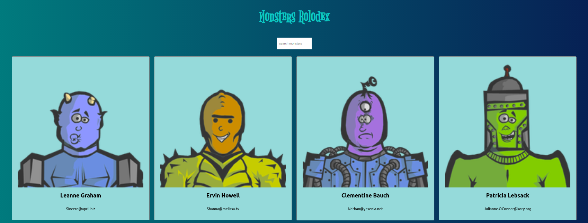

## Monsters-rolodex

The completed version of monsters rolodex project!

## Task
*  Work with React app library
*  Fetching data with API
*  Use Component Architecture
*  Responsive design

## Install dependencies

In your terminal after you clone your project down, remember to run either `yarn` or `npm install` to build all the dependencies in the project. 

<a href='http://monster-rodolex.surge.sh'>Demo</a>
